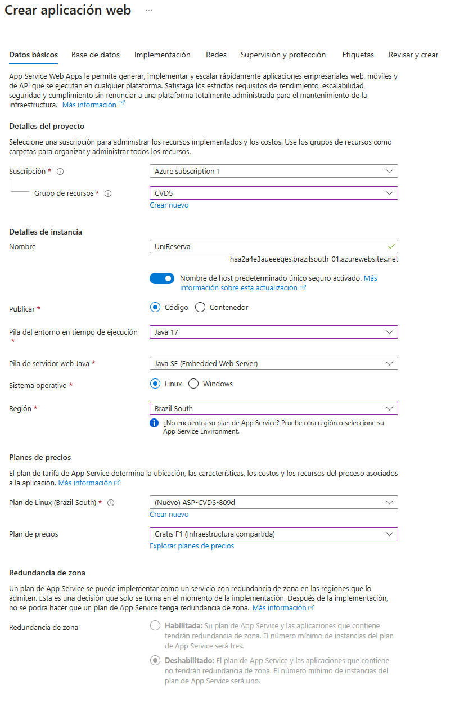

# LABORATORIO 5 - CI/CD

ESCUELA COLOMBIANA DE INGENIERÍA - CICLOS DE VIDA DE DESARROLLO DE SOFTWARE

---

## Integrantes del grupo FENRIR

- Vicente Garzón Rios
- Daniel Alejandro Diaz Camelo
- Geronimo Martinez Nuñez.
- Carlos David Barrero Velasquez.

---

## DEVOPS / CI-CD

1.  Clonamos nuestro repositorio usado en el laboratorio 4

<p align="center">
  
</p>

---

2. Luego de crear una cuenta gratuita en Azure, nos dirigimos a **App Services** > **Crear** > **Aplicación web** y creamos un "App Service"

<p align="center">
  
</p>

<p align="center">
  
</p>

<p align="center">
  
</p>

---

3. Luego de haber creado nuestra app service, nos dirigimos a **Ir al recurso** > **Implementación** > **Centro de implementación** y agregamos el repositorio

<p align="center">
  
</p>

---

4. Cuando agregamos el repositorio, Azure automaticamente genera el **Workflow file** el cual se ejecuta automáticamente, pero saldra error ya que debemos configurar las variables de entorno

<p align="center">
  
</p>

---

5. En el repositorio, nos dirigimos a **Settings** > **Secrets and variables** > **Actions** > **Secrets** > **New repository secret** y agregamos las variables de entorno requeridas, en nuestro caso `DATA_BASE_NAME` y `DATA_BASE_NAME`

<p align="center">
  
</p>

---

6. En Azure, nos dirigimos a **Configuración** > **Variables de entorno** > **Agregar** y agregamos las variables de entorno requeridas, en nuestro caso `DATA_BASE_NAME` y `DATA_BASE_NAME`

<p align="center">
  
</p>

---

6. Luego de agregar las variables de entorno en git y Azure, configuramos nuestro "Workflow file" agregando las variables de entorno en **jobs** > **steps**

```shell
- name: Environment Variables
        run: |
          echo "DATA_BASE_URL=${{ secrets.DATA_BASE_URL }}" >> $GITHUB_ENV
          echo "DATA_BASE_NAME=${{ secrets.DATA_BASE_NAME }}" >> $GITHUB_ENV
```

---

7. Luego de modificar nuestro "Workflow file", ejecutamos de nuevo

<p align="center">
  
</p>

---

8. Para probar, nos dirigimos a **App Services** > **[nombre_de_tu_servicio]** y hacemos nuestras consultas al link que obtenemos en **Dominio predeterminado**, en nuestro caso `unireserva-haa2a4e3aueeeqes.brazilsouth-01.azurewebsites.net`

<p align="center">
  
</p>
